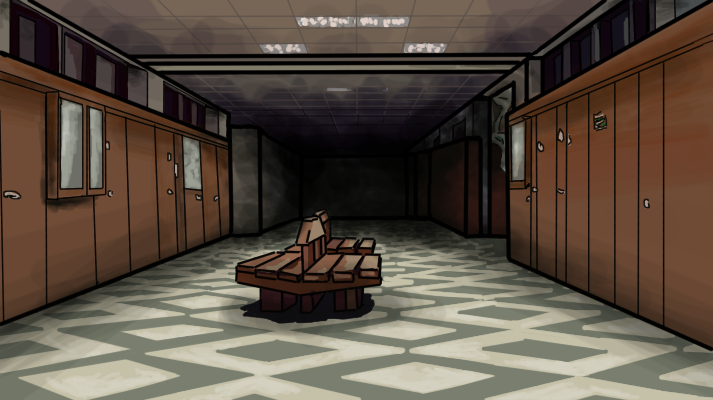

# TheGRA

theGRA - gra pisana jako projekt z przedmiotu Komunikacja Człowiek Komputer; enjoy PB z perspektywy studenta.

## DLACZEGO:

TheGRA to gierka powstała z tęsknoty studenckiej do biegania po wydziale w poszukiwaniu sali, w której odbędą się następne zajęcia. Jest to swego rodzaju uproszczony symulator studenta informatyki na PB.

szczegóły w plikach:

[TheGRA_tekstowy_dokumentacja.pdf](TheGRA_tekstowy_dokumentacja.pdf)

[TheGRA_graficzny_dokumentacja.pdf](TheGRA_graficzny_dokumentacja.pdf)

Pusty korytarz uczelni podczas pandemii (koloryzowane).

## ROZGRYWKA:

Celem rozgrywki jest jak najdłuższe utrzymanie statusu studenta poprzez odnotowywanie
swojej obecności na kolejnych zajęciach z listy wyświetlanej na dole ekranu. 

Gra oferuje 5 semestrów (każdy z innym zestawem przedmiotów), każdy po 15 tygodni.

Każda obecność na zajęciach = jeden punkt.

## Wymagane biblioteki: 

https://invisible-island.net/ncurses/ (do trybu tekstowego)

https://www.sfml-dev.org/ (do działania trybu graficznego)

------------------

- [ ] (zarządzanie pamięcią nadal niedopracowane)
- [ ] (opracowanie dokumentacji o instalacji)
